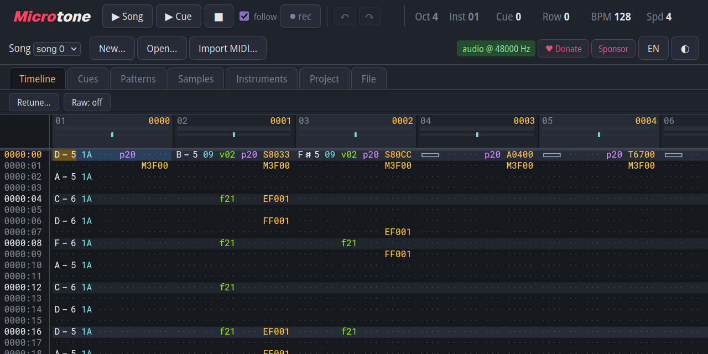

# Microtone.js



A web build of the **Microtone** tracker and the **Taud** audio engine from
[TSVM](https://github.com/curioustorvald/tsvm). Two halves:

- **Taud engine** (`src/engine/`) — a faithful JavaScript translation of the
  tracker engine in TSVM's `AudioAdapter.kt`, running inside an AudioWorklet.
  Pure computation, no DOM/Web Audio imports, so the same code runs headlessly
  under Node for conformance testing against the JVM engine.
- **Microtone tracker** (`src/ui/`) — a native web rewrite of the tracker UI
  (the TSVM `taut.js` is the behavioural reference).

## Try it

Simply visit **[microtone.curioustorvald.com](https://microtone.curioustorvald.com)** and start tracking; no strings attached.
  
## Running locally

No build step. Serve the directory with any static file server:

```sh
npm run serve            # python3 -m http.server 8737
# then open http://localhost:8737/            (tracker)
#           http://localhost:8737/player.html (minimal player)
```

## Testing

Requires Node ≥ 22.

```sh
node --test        # discovers test/node/*.test.js
```

Engine conformance is verified against PCM dumps rendered by the real JVM
engine (`tsvm/devtests/webconf/`) over the corpus in `test/corpus/`:

```sh
node tools/render-taud.js test/corpus/WHEN.taud out.pcm
node tools/compare-pcm.js out.pcm reference.pcm
```

## Layout

| Path | Contents |
|---|---|
| `src/engine/` | Taud engine port (worklet- and Node-safe, no imports outside itself) |
| `src/format/` | .taud/.tsii/.tpif parser + serialiser (gzip/zstd via `vendor/`) |
| `src/worklet/` | AudioWorkletProcessor + message protocol |
| `src/audio/` | main-thread audio system (context lifecycle, snapshots) |
| `src/doc/` | canonical document model, invertible ops, undo, worklet sync |
| `src/ui/` | tracker application (vanilla ES modules, canvas + DOM) |
| `src/storage/` | OPFS virtual disk, import/export |
| `vendor/` | vendored single-file ESM deps (see `vendor/VENDOR-VERSIONS.md`) |
| `test/corpus/` | .taud conformance/demo corpus (from the TSVM repo) |
| `tools/` | Node CLIs: render, compare, inspect, worklet-bundle |

## Provenance

Engine port keeps the Kotlin function/field names (`applyTrackerRow`,
`triggerNote`, `resolveActiveEnvelopes`, …) so future syncs against
`tsvm/tsvm_core/src/net/torvald/tsvm/peripheral/AudioAdapter.kt` diff cleanly.
Format reference: `tsvm/terranmon.txt` §"Taud serialisation format";
effect semantics: `tsvm/TAUD_NOTE_EFFECTS.md`.
